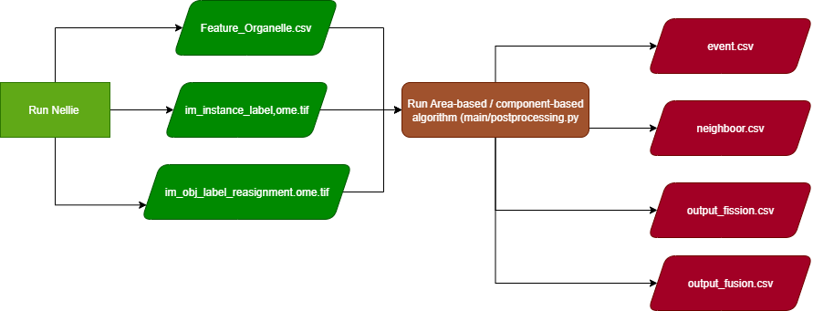

# Area-based Algorithm for Mitochondria Dynamics Tracking

This is a script for post-processing mitochondrial dynamics from Nellie's output [1]. Built-in fission-fusion estimation from Nellie's observes the change in the total number of components in each frame. This approach permits the detection of either fission or fusion events but not both in one frame, which rarely reflects the dynamic nature of mitochondria, where both fission and fusion frequently occur simultaneously. This algorithm includes an area-based algorithm that predicts fission-fusion events from a change in the area of mitochondria, and a Component-based algorithm that captures alterations in the number of components resulting from fission or fusion.

[1] A. E. Y. T. Lefebvre et al., “Nellie: automated organelle segmentation, tracking and hierarchical feature extraction in 2D/3D live-cell microscopy,” Nat. Methods, vol. 22, no. 4, pp. 751–763, Apr. 2025, doi: 10.1038/s41592-025-02612-7

# Getting Started

## Prerequisites
Please check environment.yml
  ```sh
  nellie ==0.3.1
  python=>3.11.9
  napari=0.4.19
  ```
## Usage
1. Run mitochondria timeseries in Nellie
2. Nellie will filter, segment, and track the image and output motility and morphological output
3. This algorithm uses *feature_organelle.csv*, *im_instance_label,ome,tif*, and *im_obj_label_reassignment.ome.tif* as inputs
4. Run the algorithm in main/postprocessing, specify your Nellie’s output path.
5. Outputs of the algorithm are
5.1 *event.csv*, composing morphological, coordinate, and label numbers of branches with fission/fusion. 
5.2 *neighbor.csv* neighbour of all labels for debugging
5.3 *output_fission.csv* and *output_fusion.csv*, a row represents all frames, and a column represents all labels. 0 means no fission/fusion of that label in that particular frame. 

 Figure 1: Temperature mappin with FFE_No drift Correction
